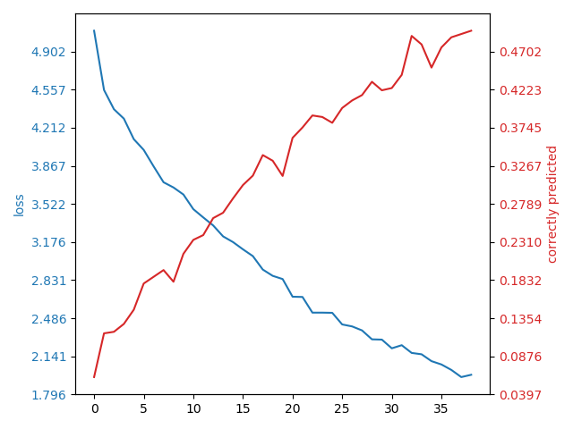
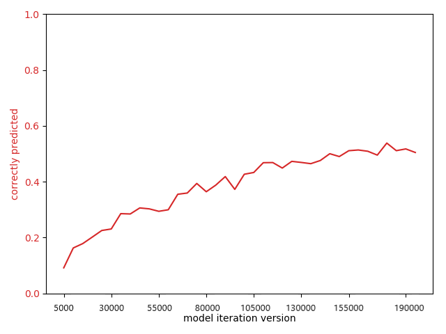
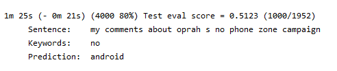
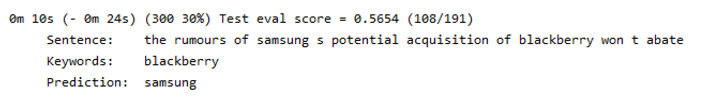
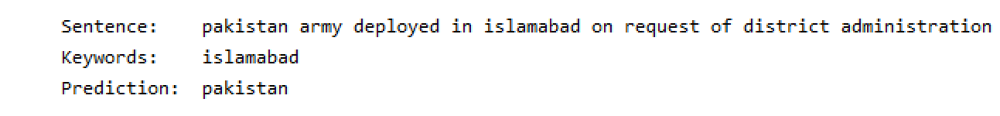

# Applied Deep Learning Exercise 2
In exercise 2 we try to implement the plan of Exercise 1. The goal here was narrowed down to try and create a Twitter Hashtag Extractor/Suggestor.
Its primary function will be to suggest keywords based on a short text with limited size (like on Twitter, instagram, etc.). 

## General Information
* Having heard that Decoder-Encoder RNNs can be used to translate sentences from one language to another in the course _Applied Deep Learning_, I have wanted to see if this could be used to do some sort of semantic keyword extraction. This project is based on the PyTorch Tutorial for sequence to sequence Networks and tries to _translate_ tweets to their respective keyswords. 
* After trying out a few different kinds of datasets, it became observable that keyword extraction was highly domain specific. Due to this I have focused on the Twitter Dataset found in the following chinese paper ([Link paper](http://jkx.fudan.edu.cn/~qzhang/paper/keyphrase.emnlp2016.pdf)). Another thing that can be observed, is that, even though we reach a respectable prediction accuracy on the validation dataset (testTweet-keyword.txt) after training only on the training dataset (trnTweet-keyword.txt), it does not work ideally for own formulated tweets. It seems that the gathered data seems to have a specific lingo in common, which the Neural Network is able to detect within the training and validation dataset. 
* The created embedding simply uses a self defined language dictionary which maps words to indices and vice versa. 

## Error Metric
To evaluate how well our model works we will see if our model classifies the correct keywords in a pool of a maximum 60 words. 60 was used as the maximum length of a Tweet is 280 characters (140 pre update) and the average characters per word are 4.79 (http://norvig.com/mayzner.html; 7.69 if only counting distinct words).  

The achieved performance metrics used in the above mentioned chinese paper _Keyphrase Extraction Using Deep Recurrent Neural Networks on Twitter_ (see Exercise 1 README) were:

| |Precision|Recall|F1-score|
|:--|:--|:--|:--|
|Joint Layer RNN | 80.74% | 81.19%|80.97%|

For their Joint Layer RNN they use more sophisticated deep recurrent neural networks, which jointly process keyword ranking, keyphrase generation, and keyphrase ranking and use word embeddings which contain semantic meaning.  
This combined with the fact that the field of Deep Learning and especially Keyword Extraction was previously unbeknownst to me, made for an interesting challenge to see how well a more simple network would fare.

For this project we define the error metric as the amount of correctly predicted keywords divided by the amount of actual keywords. 
Training data Example:
* Sentence = _I've been having a  big bang theory marathon today courtesy of my DVR. I would love to find a real-life Leonard. I'm in Crushville._
* Keywords =  _big bang theory_ (3 keywords)
* Prediction = _the big bang_ (2 correct keywords)
-> correctly predicted percentage = 0,66

### Error metric target
Considering the fact that we not only try to find one of the actual keywords, but all of them, we have set our correctly predicted percentage target to **0,3.** Thus we are happy if we are able to correctly predict 30 percent of the actual keywords. 
### Error metric achieved
Much to our surprise we were able to achieve correctly predicted percentage values of around 50 percent on the validation dataset. This is after running it on the training set for close to 200.000 iterations which is approximately twice the size of the training dataset. One iteration in this case means that one line of the training dataset was randomly chosen. 

During training we have plotted evaluated the loss as well as the error metric. We have decided to call it quits after 200.000 iterations (save model every 5000 iterations -> 40 models) to ensure that it would not overfit to our training data.

Now looking at the error metric on the validation set we can see that this seems to converge after a certain point at which self defined early stopping kicked in. 

Trying out a few examples ourself we see that this unfortunately does not seem to work too well with self formulated sentences which do not fit within Twitter culture. This could be explained by the fact that even though the training and validation datasets are different, they resemble each other in styling and lingo. 

This could be ameliorated by gathering more data, finetuning the neural network or letting it train even longer. Another way to improve this, would be to use some other form of embedding which places semantically close words next to each other in a vector space. GoogleNews-vectors-negative300.txt contains 3 million words with 300 features each which has already been trained with Google News data (100 billion words; https://code.google.com/archive/p/word2vec/). Converting the file from binary to txt using gensim (see preprocessing) took 30 mins and resulted in a 11GB file text, which is why it was skipped for this project.

## Project structure & How to
* src/settings_configuration.py

Contains all the necessary parameters/information to try out and test this project.  
To run a short demo showing a short visualization and analysis on the test dataset (testTweet-keyword.txt) simply run the main method after setting the directory in line 4 of settings_configuration.py. A prerequisite for this is, that there exists a pre-trained model to load (see parameters MODEL_ITERATIONS_VERSION, date_folder) 

### Some of the parameters which can be tried out are as follows.
* TRAIN: defines if we start training or start testing our model 

Training specific:
* NEW_MODEL: lets us keep training a model instead of starting from new
* EVALUATE_ON_TRAINING_WHILE_TRAINING: prints out evaluation analysis on training dataset during training

	    Started Training_______________________________________
	    11m 9s (- 1105m 8s) (5000 1%) Loss: 5.0906 Train eval score = 0.0615 (254/4131)
	    22m 19s (- 1094m 12s) (10000 2%) Loss: 4.5539 Train eval score = 0.1164 (509/4373)
	    33m 27s (- 1081m 54s) (15000 3%) Loss: 4.3795 Train eval score = 0.1183 (505/4268)
	    44m 35s (- 1070m 13s) (20000 4%) Loss: 4.2944 Train eval score = 0.1282 (531/4142)
	    .
	    .
	    .
	    415m 36s (- 707m 38s) (185000 37%) Loss: 2.0175 Train eval score = 0.4880 (1565/3207)
	    426m 54s (- 696m 32s) (190000 38%) Loss: 1.9526 Train eval score = 0.4921 (1527/3103)
	    438m 18s (- 685m 32s) (195000 39%) Loss: 1.9734 Train eval score = 0.4962 (1519/3061)

Testing/Evaluation specific:
* EVALUATE_ON_TESTING: lets us define if we want to evaluate on training (trnTweet-keyword.txt) or validation (testTweet-keyword.txt) dataset during our testing (see TRAIN = FALSE)
* TEST_EVALUATION_MODE: Try out different modes (values 1 to 4) to see the project in action. Except for Mode 4 all can be run from the default settings without any extra steps necessary (pre-trained model required).

	    1.   Randomly evaluates some sentences (RANDOM_EVALUATION_AMOUNT) (see pictures/EvalModeRandom.png)
		       0 ___________________
		       Input              =  i nominate thegrandehipsta ariana rilakkuma contest
		       Predicted Keywords =  ariana rilakkuma contest <EOS>
		       Actual Keywords    =  ariana rilakkuma contest  
		       1 ___________________
		       Input              =  how to create a social media marketing strategy in easy steps 
		       Predicted Keywords =  social media marketing <EOS>
		       Actual Keywords    =  social media
		       2 ___________________
		       Input              =  for presidents day we ll be posting a series of videos with great presidential speeches in film and tv !
		       Predicted Keywords =  day <EOS>
		       Actual Keywords    =  presidents day

		2.   Compare the loaded model on test dataset                     (see pictures/EvalModeValidationSet.png)
			 STARTING EVALUATION ITERATION____________________________________________________________________________
			 Sentence:    retweet the tity follow train in my last tweet ! ! 
			 Keywords:    tity follow train
			 Prediction:  follow train 

			 Sentence:    visiting stjohnsshopping this friday ? look out for the smart swaps roadshow ! see where we ll be next 
			 Keywords:    smart swaps
			 Prediction:  smart swaps 
			 0m 4s (- 0m 40s) (10 10%) Test eval score = 0.5500 (11/20)

		3.   Evaluate User Input                                          (see pictures/EvalModeInput.png)
			 STARTING CONSOLE INPUT EVALUATION____________________________________________________________________________
			 Please enter input: Trying out a few examples ourself we see that this unfortunately does not seem to work too well with self formulated sentences which do not fit within Twitter culture.
			 Input              =  trying out a few examples we see that this unfortunately does not seem to work too well with self sentences which do not fit within twitter culture .
			 Predicted Keywords =  twitter <EOS>
			 Please enter input: After trying out a few different kinds of datasets, it became observable that keyword extraction was highly domain specific
			 Input              =  after trying out a few different kinds of it became that keyword extraction was highly domain specific
			 Predicted Keywords =  gold <EOS>

		4.   Compare different models on test dataset (needs to let the model train for multiple epochs / iterations)

# Interesting Findings
Even though we did not use any form of true semantic embedding (like word2vec, GloVe), the neural network seems to have picked up on underlying information which sometimes allows it to predict words close in meaning to the actual keywords. These sometimes fit even better than the actual keywords.

Some examples of this are:
*  
* 
* 

## Work Breakdown Structure
|Task|Time estimate|Actual time EX1|Actual time EX2|
|:--|--:|--:|--:|
| Find topic and create plan|10h| **25h** |
| Understand Paper | | |10h|
| Dataset collection + preparation| 5h | | 5h|
| Network design + implementation| 20h | | 20h|
| Training + finetuning| 15h | | 13h |
| Building application | 5h | | |
| Report + presentation| *14h | | |
| Lecture | *16h| 16h | | |
| | 3 ECTS + **10h** |
