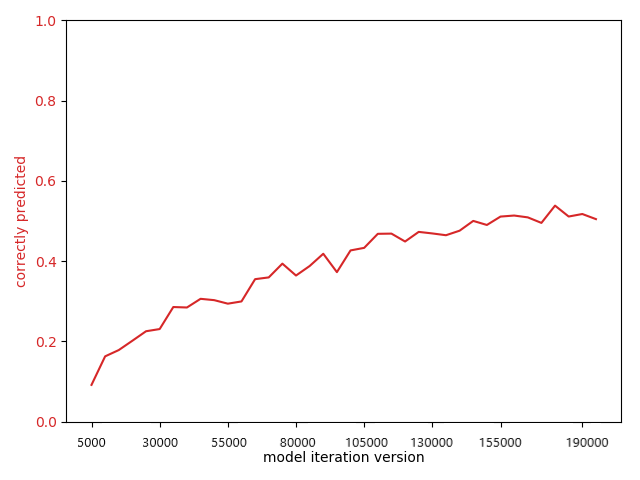

# Applied Deep Learning Final Report
As part of exercise 3 we have written a report containing an informative summary about our implemented _Keyword-Extractor_.
We have decided on taking on the problem of “Keyword Extraction” with the project type “Bring your own method”.
This subfield of Natural Language Processing has been chosen as it touches on various topics such as word embedding, text analysis/semantics, translation, summarization, etc. which are of big interest for future work.

## General Information
* The goal of this project was to create a model which is able to predict keywords from a limited size input text.
Keyword prediction in the traditional sense usually depends on bigger input sizes as semantic meaning can be more easily
transcribed if more information is contained within the input.

* Considering the fact that most personal related data nowadays sent is through social media,
 these platforms contain lots of information waiting to be tapped into. As a Business Informatics student the dataset of
 Tweets [1] is of particular interest as it could lend insight into how one could use publicly available data for
 marketing/business strategy purposes. The twitter dataset was gathered by the linked study and contains
 around 41 million unprocessed tweets. Important to note is that tweets were removed that contained multiple hashtags,
 hashtags at the end or were part of a conversation and not a standalone tweet which reduced the amount of tweets to 110k.
 This way only tweets which included a single hashtag in a semantically natural sentences were picked for the study.
 Manual random evaluation has shown that in 90% of the cases the found hashtags fit well as keyphrases.
 This dataset has been preprocessed in some way or another (remove non-latin words, special characters, etc).
Due to the sheer amount of data one needs to analyze to be able to find meaningful structures within, sophisticated algorithms
are necessary which is why Deep Learning poses an interesting opportunity.

* Having heard that Decoder-Encoder RNNs can be used to translate sentences from one language to another in the course _Applied Deep Learning_, we have wanted to see if this could be used to do some sort of semantic keyword extraction. This project is based on the PyTorch Tutorial for sequence to sequence Networks and tries to _translate_ tweets to their respective keywords.
f
* We have created a Twitter Hashtag Extractor/Suggestor, which is able to suggest keywords based on a short text with
limited size (like on Twitter, instagram, etc.).
We compared different kinds of Neural networks by trying out different parameters and network architectures.
Using an Encoder-Attention Decoder RNN reflecting the state-of-the-art proved the most successfull.

* After trying out a few different kinds of datasets, it became observable that keyword extraction was highly domain specific. Due to this we have focused on the Twitter Dataset found in the following chinese paper ([1]). Another thing that can be observed, is that, even though we reach a respectable prediction accuracy on the validation dataset (testTweet-keyword.txt) after training only on the training dataset (trnTweet-keyword.txt), it does not work ideally for own formulated tweets. It seems that the gathered data seems to have a specific lingo in common, which the Neural Network is able to detect within the training and validation dataset.

* Only looking at the Tweets [1] dataset we can say that Deep learning works pretty well for **this** kind of keyword extraction problem
as it allows to make assumptions and find underlying structures not visible to the human eye. Looking at the bigger picture though,
one must question the meaningfulness of the found model. Thus it can be said that Deep Learning proves useful for keyword extraction if one keeps the domain specific limitations in mind.

* The created embedding simply uses a self defined language dictionary which maps words to indices and vice versa.
If we were to do the project again we would use a pre trained embedding which allows semantically similar words to be placed close to each other and thus carry more meaning.

## Error Metric
To evaluate how well our model works we will see if our model classifies the correct keywords in a pool of a maximum 60 words. 60 was used as the maximum length of a Tweet is 280 characters (140 pre update) and the average characters per word are 4.79 (http://norvig.com/mayzner.html; 7.69 if only counting distinct words).

The achieved performance metrics used in the above mentioned chinese paper _Keyphrase Extraction Using Deep Recurrent Neural Networks on Twitter_ (see Exercise 1 README) were:

| |Precision|Recall|F1-score|
|:--|:--|:--|:--|
|Joint Layer RNN | 80.74% | 81.19%|80.97%|

For their Joint Layer RNN they use more sophisticated deep recurrent neural networks, which jointly process keyword ranking, keyphrase generation, and keyphrase ranking and use word embeddings which contain semantic meaning.  
This combined with the fact that the field of Deep Learning and especially Keyword Extraction was previously unbeknownst to me, made for an interesting challenge to see how well a more simple network would fare.

For this project we define the error metric as the amount of correctly predicted keywords divided by the amount of actual keywords.
Training data Example:
* Sentence = _I've been having a  big bang theory marathon today courtesy of my DVR. I would love to find a real-life Leonard. I'm in Crushville._
* Keywords =  _big bang theory_ (3 keywords)
* Prediction = _the big bang_ (2 correct keywords)
-> correctly predicted percentage = 0,66

### Error metric target
Considering the fact that we not only try to find one of the actual keywords, but all of them, we have set our correctly predicted percentage target to **0,3.** Thus we are happy if we are able to correctly predict 30 percent of the actual keywords (i.e. 100 sentences with 3 keywords each: try to correctly predict around 100 keywords).
### Error metric achieved
Much to our surprise we were able to achieve correctly predicted percentage values of over 50 percent on the validation dataset. This is after running it on the training set for close to 200.000 iterations which is approximately twice the size of the training dataset. One iteration in this case means that one line of the training dataset was randomly chosen.

During training we have evaluated and plotted the loss as well as the error metric on the training dataset. We have decided to call it quits after 200.000 iterations (save model every 5000 iterations -> 40 models) to ensure that it would not overfit to our training data.

Now looking at the error metric on the validation set we can see that this seems to similarly progress and converge after a certain point at which self defined early stopping kicked in.

Training the model for another 100.000 iterations (save model every 5000 iterations -> 20 models) seems to have decreased the loss even further on the training dataset. Looking at the correctly predicted percentage on the validation dataset below, we see that it seems to oscillate around 0,53 (min: 45%, max 60%). Thus we say that we have achieved an error metric of above 50 percent on our validation dataset.

Trying out a few examples ourself we see that this unfortunately does not seem to work too well with self formulated sentences which do not fit within Twitter culture. This could be explained by the fact that even though the training and validation datasets are different, they resemble each other in styling and lingo.

This could be ameliorated by gathering more data, finetuning the neural network or letting it train even longer. Another way to improve this, would be to use some other form of embedding which places semantically close words next to each other in a vector space. GoogleNews-vectors-negative300.txt contains 3 million words with 300 features each which has already been trained with Google News data (100 billion words; https://code.google.com/archive/p/word2vec/). Simply converting the file from binary to txt using gensim (see preprocessing in original repository) took 30 mins and resulted in a 11GB file text; this huge dimensionality is why it was skipped for this project.

## Project structure & How to
* src/settings_configuration.py

Contains all the necessary parameters which were changed/finetuned and information to try out and test this project.  
To run a short **demo** showing a short visualization and analysis on the test dataset (testTweet-keyword.txt) simply **run the main method after setting the directory** in line 4 of settings_configuration.py. A **prerequisite** for this is, that there exists a pre-trained model to load (see parameters MODEL_ITERATIONS_VERSION, date_folder). To try it out with my pretrained model, **copy the content of this folder** ([OneDrive Link](https://1drv.ms/u/s!ApPEwo6udEbQhe0K-FGEXV49RM4z8w?e=o0Lpdo); >150MB which is why it cannot be pushed onto Git) into the /models/2019-12-18-0349 directory.

#### Some of the parameters which can be tried out are as follows.
* SERVER_MODE: allows us to run a frontend demo by calling _npm run serve_ within the client folder and _python src/main.py_.
This will create the following interface on _http://localhost:8080/_ :

* TRAIN: defines if we start training or start testing our model

Training specific:
* NEW_MODEL: lets us keep training a model instead of starting from new
* EVALUATE_ON_TRAINING_WHILE_TRAINING: prints out evaluation analysis on training dataset during training

	    Started Training_______________________________________
	    11m  9s (- 1105m  8s) ( 5000 1%) Loss: 5.0906 Train eval score = 0.0615 (254/4131)
	    22m 19s (- 1094m 12s) (10000 2%) Loss: 4.5539 Train eval score = 0.1164 (509/4373)
	    33m 27s (- 1081m 54s) (15000 3%) Loss: 4.3795 Train eval score = 0.1183 (505/4268)
	    44m 35s (- 1070m 13s) (20000 4%) Loss: 4.2944 Train eval score = 0.1282 (531/4142)
	    .
	    .
	    .
	    415m 36s (- 707m 38s) (185000 37%) Loss: 2.0175 Train eval score = 0.4880 (1565/3207)
	    426m 54s (- 696m 32s) (190000 38%) Loss: 1.9526 Train eval score = 0.4921 (1527/3103)
	    438m 18s (- 685m 32s) (195000 39%) Loss: 1.9734 Train eval score = 0.4962 (1519/3061)

Testing/Evaluation specific:
* EVALUATE_ON_TESTING: lets us define if we want to evaluate on training (trnTweet-keyword.txt) or validation (testTweet-keyword.txt) dataset during our testing (see TRAIN = FALSE)
* TEST_EVALUATION_MODE: Try out different modes (values 1 to 4) to see the project in action. Except for Mode 4 all can be run from the default settings without any extra steps necessary (pre-trained model required).

	    1.   Randomly evaluates some sentences (RANDOM_EVALUATION_AMOUNT) (see pictures/EvalModeRandom.png)
		       0 ___________________
		       Input              =  i nominate thegrandehipsta ariana rilakkuma contest
		       Predicted Keywords =  ariana rilakkuma contest <EOS>
		       Actual Keywords    =  ariana rilakkuma contest  
		       1 ___________________
		       Input              =  how to create a social media marketing strategy in easy steps 
		       Predicted Keywords =  social media marketing <EOS>
		       Actual Keywords    =  social media
		       2 ___________________
		       Input              =  for presidents day we ll be posting a series of videos with great presidential speeches in film and tv !
		       Predicted Keywords =  day <EOS>
		       Actual Keywords    =  presidents day

		2.   Compare the loaded model on test dataset                     (see pictures/EvalModeValidationSet.png)
			 STARTING EVALUATION ITERATION____________________________________________________________________________
			 Sentence:    retweet the tity follow train in my last tweet ! ! 
			 Keywords:    tity follow train
			 Prediction:  follow train 

			 Sentence:    visiting stjohnsshopping this friday ? look out for the smart swaps roadshow ! see where we ll be next 
			 Keywords:    smart swaps
			 Prediction:  smart swaps 
			 0m 4s (- 0m 40s) (10 10%) Test eval score = 0.5500 (11/20)

		3.   Evaluate User Input                                          (see pictures/EvalModeInput.png)
			 STARTING CONSOLE INPUT EVALUATION____________________________________________________________________________
			 Please enter input: Trying out a few examples ourself we see that this unfortunately does not seem to work too well with self formulated sentences which do not fit within Twitter culture.
			 Input              =  trying out a few examples we see that this unfortunately does not seem to work too well with self sentences which do not fit within twitter culture .
			 Predicted Keywords =  twitter <EOS>
			 Please enter input: After trying out a few different kinds of datasets, it became observable that keyword extraction was highly domain specific
			 Input              =  after trying out a few different kinds of it became that keyword extraction was highly domain specific
			 Predicted Keywords =  gold <EOS>

		4.   Compare different models on test dataset (needs to let the model train for multiple epochs / iterations; was used to create the plots)

# Interesting Findings
Even though we did not use any form of true semantic embedding (like word2vec, GloVe), the neural network seems to have picked up on underlying information which sometimes allows it to predict words close in meaning to the actual keywords. These sometimes fit even better than the actual keywords.

Some examples of this are:
* 
* 
* 

This even seems to hold true for insider knowledge within a certain topic. In the following case the neural networks seems to have learned that geminis and lions seem to be similar within the astrology world.
* 

## Work Breakdown Structure
As can be seen in the following table, a lot of time went into preparation and trying to understand the problem at hand.
This is to be expected when researching a new topic for the first time. More time than necessary was spent on this,
but this was due to own interest. For future work it would be interesting to see, how well a project progresses if one
starts the implementation without much background knowledge. Implementing the Network and finetuning it took less time than
estimated, but this is due to the fact that this was cut short as the scope of the project has already become too large.
All in all the project was a lot of fun and proved very successful as an introduction to Deep Learning.

|Task|Time estimate|Actual time|
|:--|--:|--:|
| Find topic and create plan|10h| 25h |
| Understand Papers | |10h|
| Dataset collection + preparation| 5h | 2h|
| Network design + implementation| 20h | 18h|
| Training + finetuning| 15h |13h |
| Building application | 5h | 6h |
| Report + presentation| *14h|10h |
| Lecture | *16h| 14h | |
| | 3 ECTS + **10h** | 3 ECTS + **23h**

\* taken from the lecture TISS website

#### References
[1] Wang, Yang et al. (2016). Keyphrase Extraction Using Deep Recurrent Neural Networks on Twitter.  836-845. 10.18653/v1/D16-1080.

[2] Basaldella, Marco et al. (2018). Bidirectional LSTM Recurrent Neural Network for Keyphrase Extraction. _IRCDL_.

[3] Meng, Rui et al. (2017). Deep Keyphrase Generation. 582-592. 10.18653/v1/P17-1054.

[4] Dabiri, Sina (2018). Tweet-Classification-Deep-Learning-Traffic. Github repository: https://github.com/sinadabiri/Tweet-Classification-Deep-Learning-Traffic

[5] Johnson, Rie & Zhang, Tong. (2015). Semi-supervised Convolutional Neural Networks for Text Categorization via Region Embedding. Advances in neural information processing systems. 28. 919-927.

[6] Yang, Zichao et al. (2016). Hierarchical Attention Networks for Document Classification. _HLT-NAACL_.